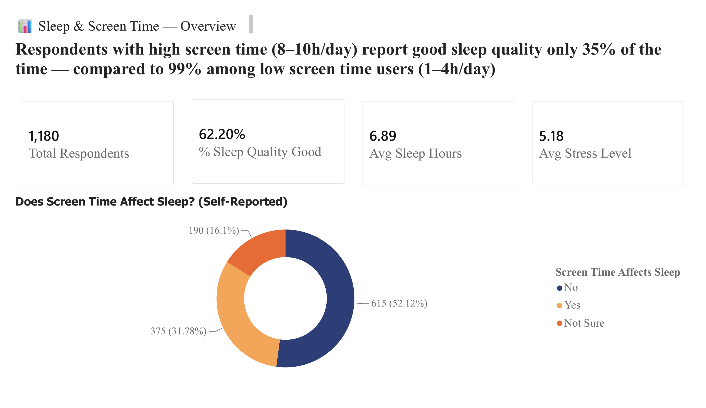
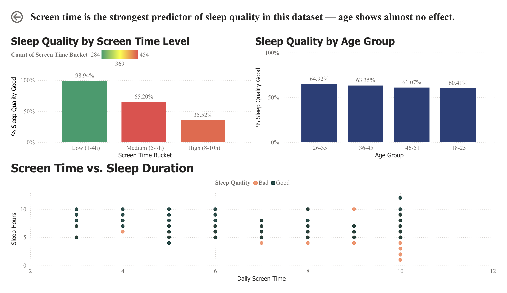

# 📊 Sleep & Screen Time Analysis

Analyzing how digital screen usage impacts sleep quality — from raw survey data to an interactive Power BI dashboard.

---

## Background

Digital device usage has become a daily habit for most people, especially before bedtime. This project investigates whether screen time is actually linked to sleep quality, using survey data collected from **1,181 respondents** covering demographics, screen habits, stress levels, and self-reported sleep quality.

The dataset combines two sources: a primary survey dataset (*Impact of Digital Device Usage on Sleep Quality and Mental Health*) and a supplementary Thai-language survey, merged and cleaned into a single analysis-ready dataset.

## Business Question

> **Does screen time before bed meaningfully affect sleep quality — and which factor matters more: screen habits or age?**

Sub-questions explored:
- How much does daily screen time correlate with sleep quality?
- Does age group influence sleep quality more or less than screen time?
- Are respondents aware of the impact screen time has on their own sleep?

## Data Source

| Item | Detail |
|---|---|
| Primary dataset | 1,100 rows — [Digital Devices Effects on Sleep & Mental Health (Kaggle)](https://www.kaggle.com/datasets/narayan1517/digital-devices-effects-on-sleep-and-mental-health) |
| Self-collected survey | 86 rows — Google Form (Thai language) |
| Respondents (merged) | 1,181 (after cleaning & deduplication) |
| Features | Age, Sleep Hours, Daily Screen Time, Stress Level, Use Before Sleep, Anxiety/Low Mood, Wellness Apps, Feel Rested, Sleep Quality, Screen Time Affects Sleep (self-reported) |
| Format | CSV (merged from 2 source surveys) |

## Tools

- **Python (Google Colab)** — data cleaning, merging, encoding, EDA, correlation & group analysis
- **Pandas / Seaborn / Matplotlib** — data wrangling and exploratory visualization
- **Power BI Desktop** — interactive dashboard, DAX measures, storytelling visuals

## Process

1. **Data Cleaning** — merged two survey sources, handled missing values, removed duplicates, standardized inconsistent value formats (e.g., numeric ranges written as text)
2. **Categorical Mapping** — translated Thai-language survey responses into consistent English categories to align with the primary dataset
3. **Encoding** — applied binary mapping (Yes/No), ordinal encoding (Feel Rested, Sleep Quality), and one-hot encoding (target variable) depending on variable type
4. **Outlier Handling** — applied winsorization to Age and Daily Screen Time to reduce the influence of extreme values
5. **Exploratory Data Analysis** — correlation heatmap and grouped comparisons to identify which variables actually drive sleep quality
6. **Insight Analysis** — bucketed screen time and age into groups to quantify their real-world effect on sleep quality
7. **Dashboard Build** — exported a decoded, human-readable dataset and built an interactive 2-page Power BI dashboard with KPI cards, breakdown charts, and a scatter plot

## Key Findings

**1. Screen time is the strongest predictor of sleep quality — not age.**
Respondents with low daily screen time (1–4h) report good sleep quality **99%** of the time, compared to just **35%** among those with high screen time (8–10h). That's nearly a 3x gap driven entirely by screen habits.

**2. Age has almost no effect on sleep quality.**
Across all age brackets (18–25, 26–35, 36–45, 46–51), the share of respondents with good sleep quality stays consistently around **60–65%** — flat, regardless of age. This challenges the common assumption that younger people sleep worse because of phone use; the data shows behavior matters more than age.

**3. Stress is closely tied to screen time.**
Stress level correlates with daily screen time (r ≈ 0.53) and negatively correlates with sleep quality (r ≈ -0.50), suggesting screen time may affect sleep partly through elevated stress — though this is a correlation, not proven causation.

**4. People underestimate the impact of their own screen habits.**
Only **32%** of respondents believe screen time affects their sleep, while the data shows a clear, measurable effect. This gap between perception and reality is itself a notable finding.

## Recommendation

- Interventions aimed at improving sleep quality should target **screen time behavior directly** (e.g., screen time limits, blue-light reduction before bed) rather than age-based campaigns, since age was not a meaningful driver in this dataset.
- Awareness campaigns could focus on closing the **perception gap** — many people don't realize how much their screen habits affect their sleep, so education alongside behavioral tools may be more effective than habit-change tools alone.
- Future data collection could add device type, notification frequency, or app category (e.g., social media vs. reading) to better understand *what kind* of screen time matters most.

## Dashboard Preview

**Overview**

**Screen Time & Sleep Quality**

*A Thai-language version of both pages is also included in `assets/` (`dashboard_overview_th.png`, `dashboard_screentime_th.png`).*

## Files in This Repo

| File | Description |
|---|---|
| `notebooks/01_cleaning_SleepKan.ipynb` | Data loading, merging two survey sources, cleaning, duplicate/outlier handling |
| `notebooks/02_encodingEDA_SleepKan.ipynb` | Categorical encoding, correlation heatmap, EDA visuals, target encoding |
| `notebooks/03_insight_analysis_SleepKan.ipynb` | Group-level insight analysis (screen time buckets, age groups) + export of dashboard-ready dataset |
| `data/sleep_data_for_powerbi.csv` | Decoded, dashboard-ready dataset |
| `dashboard/SleepScreenTime.pbix` | Power BI dashboard file |

## Related Project — Machine Learning Extension

This project focuses on exploratory analysis and dashboard storytelling. The same dataset was also used to build and deploy a **3-class prediction model** (Meta-Stacking Ensemble: LightGBM + SVM + PyTorch NN, 74.26% accuracy) with a live Streamlit web app:

👉 [Project_ImpactSmartphoneUsageonSleepQuality](https://github.com/kannchp/Project_ImpactSmartphoneUsageonSleepQuality) — covers feature engineering, class imbalance handling (SMOTE), model comparison across 17 techniques, and deployment.

---

*This project was built as part of a cooperative education (สหกิจศึกษา) application, focused on demonstrating end-to-end data analyst skills: data cleaning, exploratory analysis, insight generation, and dashboard storytelling.*
